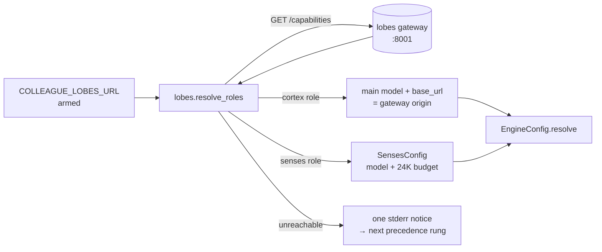
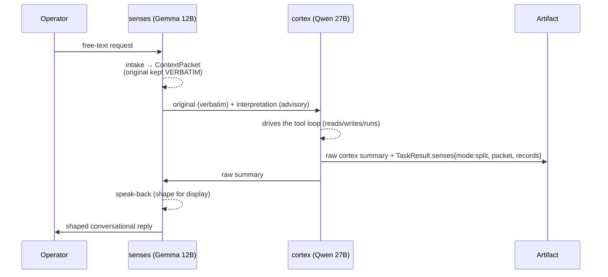
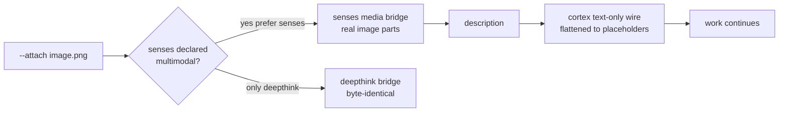

# Cortex + senses — architecture & data flow

A visual companion to [`cortex-senses.md`](cortex-senses.md) (which covers
config, modes, and honest limits in prose). This doc is the **map**: the
components, how data flows through them, the two models, and what the split
actually enables.

> One line: colleague resolves **two models by ROLE** from the lobes gateway —
> **cortex** drives the tool loop, **senses** perceives the request and speaks the
> result back — with the operator's original request preserved verbatim across the
> boundary and a senses layer that structurally cannot act.

---

## The two minds

Roles, not model ids. colleague hard-codes **zero** model names — it asks the
lobes gateway `GET /capabilities` who is playing each role (probed live
2026-07-03 on the reference rig).

| | **cortex** | **senses** |
|---|---|---|
| **Role** | the authoritative mind that drives the loop | the tools-off front door |
| **Model (rig, 2026-07)** | `Qwen3.6-27B-Text-NVFP4-MTP` | `gemma-4-12B-it-NVFP4A16` |
| **Context window** | 128K (131072) | 32K (32768) |
| **Runtime** | vLLM | vLLM · **multimodal** |
| **Tool-calling** | **yes** — the only lobe that tool-calls on the rig | **no** — structurally tools-off |
| **Responsibilities** | reasoning, deciding, planning, `tool_use`, repo actions, validation, **final authority** | `intake`, `normalize_input`, `classify_intent`, `prepare_context_packet`, `speak_back` |
| **Forbidden** | — | `final_decision`, `repo_action`, `security_decision` |

The forbidden list is not a promise — it is **enforced structurally** (see
[Safety & trust properties](#safety--trust-properties-the-invariants) below and
the feature doc's [cannot-act guarantee](cortex-senses.md#the-cannot-act-guarantee)).

---

## Components

Each part, what it does, and where it lives. Everything is runtime-owned, so
**every backend inherits it** (the all-engines rule); absent config → strict
no-op, byte-identical to v1.34.0.

| Component | File | Role |
|---|---|---|
| **Lobes client** | `colleague/lobes.py` | `resolve_roles(gateway)` — urllib `GET /capabilities`, parse roles, degrade-to-`None` on any error. No subprocess. |
| **The contract** | `colleague/contract.py` | `ContextPacket {original, interpretation, confidence, task_type, omissions}` · `Task.context_packet` · omit-when-None `TaskResult.senses {mode, packet, records}`. |
| **Config + discovery rung** | `colleague/config.py` | `SensesConfig` (mirror of `DeepthinkConfig`) + the lobes rung in `EngineConfig.resolve` — precedence `flag > env > config.json > lobes > builtin`. |
| **Senses invocation** | `colleague/senses.py` | `run_senses_intake` / `run_senses_speakback` / `run_senses_media_bridge` — one bounded tools-off completion each, windowed to the senses budget, degrade-never-raise. |
| **Loop integration** | `colleague/loop.py` | packet injection (verbatim original + advisory companion) · the senses-preferred media bridge · folds records onto `TaskResult.senses`. |
| **Session split** | `colleague/cli/_commands/session.py` | free-text → intake → packet → `execute_work`; display-layer speak-back; `--cortex-only` / `--debug-senses`. |
| **Resident split** | `colleague/resident/appserver.py` | inbound mesh message → intake → work item → shaped reply, under the unchanged c19 trust model. |
| **Lobes noun** | `colleague/cli/_commands/lobes.py` | read-only `colleague lobes show/overview --json` — armed state + resolved roles + degradation rung. |
| **Measurement livecheck** | `colleague/livecheck.py` | `run_cortex_senses_check` — same task cortex-only vs split, graded from artifact evidence; honest-SKIP when the stack isn't serving. |

---

## Data flow

### 1 · Role resolution (per run, no disk cache in v1)

Precedence: **explicit flag > `COLLEAGUE_*` env > `.colleague/config.json` >
lobes discovery > builtin**. Zero model ids in colleague. An unreachable gateway
degrades to the next rung with exactly one notice — never a hard fail.

> **Rig note:** the per-role `endpoint` field in the payload reports `:8000`,
> which is *not* client-reachable — colleague dials the **gateway origin**
> (`:8001`, where `/capabilities` is served) instead. Filed upstream as
> lobes-cli#87.

### 2 · A split-mode request (session / mesh)

Two invariants ride this path:

- **The operator's original request is cortex's first message, verbatim** — the
  interpretation is an *advisory companion*, never a replacement.
- **The artifact keeps the raw cortex summary**; only the *displayed* reply is
  shaped. Nothing is hidden — the raw text and the shaped text both persist.

A degraded intake (malformed/empty) simply attaches no packet and the **raw
request proceeds** — the run never fails.

### 3 · Media perception (the bridge)

The real image parts ride **only** the multimodal second model's wire; the
text-only cortex wire is flattened to placeholders. Delivery is **verified**
(`delivered` / `dropped` / `bridged` recorded), never assumed.

---

## What it enables (effects)

- **Role-based model selection** — swap the served models on the rig and
  colleague follows, with zero config edits (no model ids in colleague).
- **A conversational front door** — speak-back shapes replies into plain
  language instead of a raw cortex dump (*nice*).
- **Intent perception** — intake surfaces what a request left implicit
  (`omissions`) before cortex acts (*helpful*).
- **Multimodal perception** — images/audio reach a role built to see them
  (senses), described back to a text-only cortex.
- **Measurable architecture** — the split is graded against cortex-only from
  artifact evidence (runtime facts only, no quality score).
- **Zero-cost when off** — no senses config → byte-identical to single-model
  colleague (proven, not asserted).

---

## Safety & trust properties (the invariants)

| Property | How it's guaranteed |
|---|---|
| **Verbatim original** | `packet.original` is set from the input string, never the model output — cortex always sees the exact ask. Live-proven. |
| **Cannot act** | senses issues only `make_complete(tools=[])`; it imports no `ToolExecutor`/`subprocess`; tool-call-shaped output is inert data. Proven even against adversarial output. |
| **Degrade, never raise** | every senses/lobes failure returns `None` + a degraded record; the caller falls back to the raw path. A dual run never fails because senses is unreachable. |
| **Byte-identical when absent** | no senses/lobes config → no new artifact keys, no extra calls, no behavior change. `test_e2e_mock` / `test_zero_deps` / `test_boundary` pass unmodified. |
| **Honest measurement** | the livecheck grades runtime facts only and SKIPs (never fabricates) when the stack isn't serving. |

---

## The boundary this holds

This is the **second sanctioned increment** at colleague's router-exclusion
boundary (after the deepthink dual-model escalation): **two declared roles,
fixed responsibilities, no automatic task→model routing**. Still explicitly out
of scope, each pending its own re-spec: senses-direct-for-cheap-tasks (#276) and
the voice loop + retrieval (#277).

## See also

- [`cortex-senses.md`](cortex-senses.md) — config, modes, per-run flags, honest limits.
- Spec: `docs/specs/2026-07-03-colleague-drives-with-a-cortex-and-senses-it-resol.md`
- Plan: `docs/plans/2026-07-03-colleague-drives-with-a-cortex-and-senses-it-resol.md`
- Live evidence: `docs/live-testing.md` rows 17–18.
